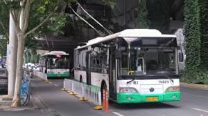
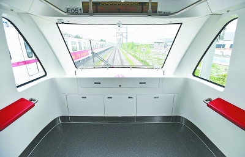

Page 1
一、封面页（30 秒）​

    主标题：轨道向前，车轮转型 —— 武汉交通的时代故事​

    副标题：我与我的新时代（聚焦公交与地铁变迁）​

    展示人 / 日期：XXX | 2025.11​

    背景：
    

    

Page 2
二、目录页（20 秒）​

    记忆开篇：武汉公交的传说​

    核心对比：公交 “退” 与地铁 “兴”​

    时代逻辑：变迁背后的密码​

    我的共鸣：成长与交通同频​

    总结：交通里的新时代与青年担当​

    致谢​

Page 3
三、记忆开篇：武汉公交的传说​

    在过去的武汉街头，流传着这样一种传说。

    “天上战斗机，地上521。”

    “集齐四辆521在洪山广场上转圈，可以打开时空之门。”

    “武汉521，公路上的F1。”

    说的不是什么暗号，而是“飙车时车轮起过火”的武汉521路公交车
    。

    <video controls src="pictures/Page3/521.mp4" title="Title"></video>

四、核心对比：公交 “退” 与地铁 “兴”（1 分 30 秒）​
Page 4
1. 公交 “退” 与地铁 “兴”

常规公交客运占公共交通客运总量的比重由2011年74.7%下降到2019年47.7 %，同期轨道交通占比由3.9%提升至41%（其他为出租车及轮渡客运量）。
（绘制折线图）

Page 5
2. 公交 “退”
公交停运，优化重复线路
（插图）

Page 6
开设大站快线“K字头”
（插图）

Page 7
开设定制公交，满足特定群体需求
（插图）

Page 8
3. 地铁 “兴”

运营里程达 518 公里（含鄂州延伸段），跻身世界前十，覆盖武汉全域 + 鄂州葛店，无缝衔接机场、三大火车站，跨江跨区客流占比超 40%。

2 号线开创全国地铁穿长江先例，后续累计 6 次成功穿越长江，最深盾构深度达地下 30 米

2021 年开通的 5 号线为武汉首条真正无驾驶室的全自动驾驶线路，实现列车唤醒、运营、回库全流程自动化，故障率降至百万列公里 0.7 次，准点率达 99.99%，较普通线路效率提升 7.3%。

2024 年夏季延长 2、5 号线运营至凌晨，跨年夜连续运营 21 小时，运送夜间乘客 24.18 万人次，司门口黄鹤楼站年客流超千万，成为 “地铁 + 文旅” 标杆。

2 号线十汉区间攻克 136 个溶洞（最大直径 13.8 米）的岩溶发育区，创新 “先填后掘 + 镶齿滚刀” 技术，为同类工程提供范本。

Page 9
地铁线路快速扩展，覆盖主要城区
（插图）

Page 10
五、时代逻辑：变迁背后的密码（40 秒）

武汉从 “三镇分立” 到 “都市圈融合”（建成区翻倍），市民需 “快、稳、舒适” 出行：地铁 37 分钟平均通勤时耗（800 米覆盖率全国第三），公交 “拥堵迟到” 痛点凸显，绿色政策（如 “武碳江湖”）更青睐地铁。

两者形成 “地铁骨干 + 公交接驳” 互补网，本质是新时代交通向 “高效、精准、绿色” 升级的缩影。

Page 11
六、我的共鸣：成长与交通同频（40 秒）

​536路从汉口火车站到光谷大道，后改线为光谷广场到武汉未来科技城，到如今停运

地铁2号线东沿线经过华中科技大学与家门口

雄楚大道BRT改造使得738配车从双层车到10m单层车到如今6m小巴

Page 12
七、总结：交通里的新时代（30 秒）​

    核心观点：公交 “退” 是迭代，地铁 “兴” 是需求，二者互补共生​

    公交“退”与地铁“兴”，是城市交通的迭代共生，更是国家转型的生动注脚——这背后，藏着新时代的发展智慧与青年担当。
公交的“退”，是主动迭代而非退场：以大站快车、定制公交精准对接需求，用地铁接驳线填补服务空白，既疏解拥堵，又守好民生温度。地铁的“兴”，是顺势而为更是担当：以大运量、高速度承载城市活力，成为发展的动力引擎。一“退”一“兴”，是“以人民为中心”的鲜活实践。

这恰是我们与时代的相处之道：青年如地铁，可凭专业硬核攻坚；如定制公交，可精准补位暖心。不必强求一律的“高速”，但需练就精准作为的本领，在时代大局中实现价值。

新时代是各扬所长的交响，青年与时代是双向成就的征程。读懂交通的互补之道，便明晰使命：以地铁之锐突破，以公交之智应变，与时代同频共振。

让我们与时代并肩，迭代中守初心，共生中勇担当，共赴美好新征程！

Page 13
八、致谢页（20 秒）​

    标题：感谢聆听！​

    配图：武汉地铁公交同框夜景（简洁版）​

    底部文字：以交通为笔，写我们的新时代故事​

